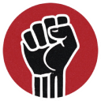

  

# Boykot – Chrome Eklentisi

Türkiye'deki adaletsizliklere, baskıya ve hukuksuzluğa sessiz kalan şirketleri ifşa eder.  
Ziyaret ettiğiniz web sitesinin boykot listesinde olup olmadığını anında öğrenin.  
**Halktan kazanıp saraya çalışanlara geçit yok.**

---

## 🚨 Ne Yapar?

Boykot, belirlenen şirketlerin web sitelerine girdiğinizde ekranın üzerine uyarı ekranı yerleştirir.  
Bu uyarı, sizi bilgilendirir ve bilinçli bir dijital duruş sergilemenizi sağlar.

> Örnek Uyarı:  
> "Bu firma Türkiye'deki adaletsizliklere göz yummuştur. Sessiz kalan, suça ortaktır. Vicdanınıza kulak verin."

## 🎯 Kişisel Boykot Listesi

Eklenti panelinden kendi boykot listenizi oluşturabilirsiniz:
- Sağ üst köşedeki eklenti ikonuna tıklayın
- "Yeni Domain Ekle" bölümüne engellemek istediğiniz sitenin domain adresini girin (örn: example.com)
- "Ekle" butonuna tıklayın

Eklediğiniz domainler:
- Kalıcı olarak saklanır
- Tarayıcıyı kapatıp açsanız bile kaybolmaz
- Sadece sizin tarayıcınızda görünür
- İstediğiniz zaman yeni domainler ekleyebilirsiniz

---

## 📌 Hangi Siteler Uyarı Verir?

Eklentide yer alan **boykot listesi**, zamanla güncellenmektedir.  
Bazı örnek markalar:

- EspressoLab  
- D&R  
- İdefix  
- Demirören AVM  
- Kilim Mobilya  
- Ülker  
- TRT  
- CNN Türk  
- Fanatik  
- TGRT  
- İhlas Ev Aletleri (Arzum)  
- Turkuaz Yayınevi  
- Milli Piyango  
- misli.com  
- iddaa.com  
- ETS Tur  
- DHA  
- İHA  
- Akşam Gazetesi  
- Audi Türkiye  
- Beyaz TV  
- Doğuş Grubu  
- Kral FM  
- Günaydın Restoran  
- NTV  
- Nusret  
- Škoda Türkiye  
- Volkswagen Türkiye  
- Türkiye Gazetesi  
- Yeni Şafak  
- ve diğerleri...

> Tam liste için eklentiyi yükleyin ya da katkıda bulunun.

---

## 🧭 Neden Boykot?

24 Mart 2025'te CHP Genel Başkanı Özgür Özel, şu çağrıda bulundu:

> **"Parayı bizden kazanıp, sadece saraya hizmet yok. Boykot et!"**

Boykot bu çağrıdan yola çıkılarak geliştirilmiştir. Amacı bilinçli tüketicileri dijital ortamda da bilgilendirmektir.

---

## 🔧 Nasıl Kurulur?

1. Bu repoyu indirin veya klonlayın.
2. Chrome'da `chrome://extensions/` sayfasını açın.
3. Sağ üstten "Geliştirici Modu"nu aktif edin.
4. "Paketlenmemiş öğe yükle"ye tıklayın.
5. İndirdiğiniz klasörü seçin.

---

## 📬 Katkıda Bulunmak İster misin?

- Yeni şirket eklemek  
- Bildiğiniz bir markayı listede görmek  
- Eklentiye yeni özellikler önermek  

Tüm bunlar için:  
👉 [Pull request gönderin](https://github.com/anilsakadev)  
👉 veya mail atın: [acaglarsaka@gmail.com](mailto:acaglarsaka@gmail.com)

---

## 📢 Güncel Tartışmaları Takip Et

👉 [X'te #Boykot etiketini takip et](https://x.com/hashtag/Boykot?src=hashtag_click)

---

## 📝 Lisans

MIT Lisansı altında sunulmuştur. Dileyen herkes katkı sağlayabilir, geliştirebilir.

---

